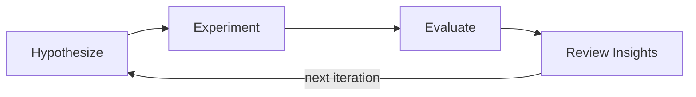

# AURA

AURA (**Au**to **R**esearch **A**nything) is a domain-agnostic framework for building self-improving research loops. An LLM proposes hypotheses, a runner executes them, an evaluator scores the results, and a reviewer distills insights -- then the loop repeats. The code is minimal and hackable, the LLM interface is a single `Callable[[str], str]` that works with any provider, and all run state is persisted as human-readable JSON so runs are resumable and inspectable. It aims at working for hyperparameter search, agent skill creation, code improvement, benchmark generation, and any other scenario that follows a hypothesize-experiment-evaluate cycle. Inspired by [autoresearch](https://github.com/karpathy/autoresearch).



## Installation

```bash
git clone https://github.com/UCSB-NLP-Chang/AutoResearchAnything.git
cd AutoResearchAnything
uv sync
```

## Quick Start

An LLM-guided hyperparameter search in one file:

```python
from aura import (
    Pipeline, Workspace, setup_logging,
    Researcher, ScriptExperimenter, MetricEvaluator, Reviewer,
    anthropic_llm,
)

setup_logging()
llm = anthropic_llm(model="claude-sonnet-4-20250514")

workspace = Workspace.create("./runs/experiment")

pipeline = Pipeline(
    researcher=Researcher(
        runner=llm,
        prompt_template=(
            "Propose {{ num_tasks }} experiments as JSON list with: id, lr, epochs, batch_size.\n\n"
            "Context: {{ inputs }}\nInsights: {{ insights }}"
        ),
        num_tasks=3,
    ),
    experimenter=ScriptExperimenter(
        "python train.py --lr {lr} --epochs {epochs} --batch-size {batch_size}"
    ),
    evaluator=MetricEvaluator(metric="accuracy", baseline=0.5),
    reviewer=Reviewer(runner=llm),
    workspace=workspace,
    max_iterations=3,
)
pipeline.run()

summary = workspace.summary()
print(f"Best: {summary['best_score']} (task: {summary['best_task_id']})")
```

See [`examples/`](examples/) for runnable demos.

## How It Works

Four pluggable components form the pipeline:

| Component | Role | Built-in implementations |
|---|---|---|
| **Researcher** | Proposes hypotheses | `Researcher(runner=..., prompt_template=...)` |
| **Experimenter** | Executes each hypothesis | `ScriptExperimenter`, `FunctionExperimenter`, `LLMExperimenter` |
| **Evaluator** | Scores the results | `MetricEvaluator`, `Evaluator(runner=..., prompt_template=...)` |
| **Reviewer** | Distills insights from a batch | `Reviewer(runner=..., prompt_template=...)` |

Each stage accepts a `runner=` argument — any `LLMCallable` or `Runner` instance — which becomes the default implementation. Override the stage's core method for full control.

Every run is fully serialized: hypotheses, experiments, evaluations, and insights are saved as human-readable JSON in a workspace directory. The pipeline supports tracked **artifacts** (files or directories that evolve across iterations) with automatic snapshotting and optional rollback to the best-scoring state.

## Runner Abstraction

`Runner` is an AURA-agnostic execution backend. All three LLM-backed stages (`Researcher`, `Evaluator`, `Reviewer`) accept a `runner=` argument:

```python
from aura import LLMRunner, FunctionRunner, CommandRunner, as_runner

# Wrap any LLMCallable
runner = LLMRunner(anthropic_llm())

# Wrap a Python function
runner = FunctionRunner(lambda prompt, ctx: {"content": my_fn(prompt)})

# Shell out to a CLI agent (claude, codex, aider, ...)
runner = CommandRunner(["claude", "--output-format", "json"], output_format="json")

# as_runner() normalises LLMCallable | Runner -> Runner
runner = as_runner(my_llm_callable)
```

Pass any of these as `runner=` to `Researcher`, `Evaluator`, or `Reviewer`:

```python
Researcher(runner=CommandRunner(["claude"]), prompt_template="...")
```

## Composable Experimenter Backends

`SingleTrialExperimenter` is the base for experimenters that run one trial per hypothesis. Compose an experimenter from sub-components:

| Sub-ABC | Role | Implementations |
|---|---|---|
| `Environment` | Set up execution environment | `CondaEnvironment`, `VenvEnvironment`, `UvEnvironment`, `DockerEnvironment` |
| `Executor` | Run the hypothesis | `ScriptExecutor`, `FunctionExecutor`, `LLMExecutor`, `BwrapExecutor`, `BindfsExecutor`, `SlurmExecutor` |
| `Collector` | Parse executor output into a `Trial` | `StdoutCollector`, `JSONFileCollector`, `LogParserCollector` |
| `Aggregator` | Reduce trials to a summary | `LastTrialAggregator`, `BestTrialAggregator`, `AllTrialsAggregator` |

```python
from aura import (
    SingleTrialExperimenter,
    ScriptExecutor, StdoutCollector, BestTrialAggregator,
    CondaEnvironment,
)

class MyExperimenter(SingleTrialExperimenter):
    env = CondaEnvironment("ml-env")
    executor = ScriptExecutor("python train.py --lr {lr}")
    collector = StdoutCollector(parse_json=True)

    def prepare(self, task, workspace):
        ctx = super().prepare(task, workspace)
        return {**ctx, **self.env.setup(task, workspace)}

    def execute(self, task, context, workspace):
        return self.executor.run(task, context, workspace)

    def collect(self, task, raw, context, workspace):
        return self.collector.collect(task, raw, context, workspace)
```

For sandboxed execution, use `BwrapExecutor` (bubblewrap, no root required) or `BindfsExecutor` (FUSE bind-mounts for read-only inputs).

## Type Hierarchy

```
Hypothesis  →  Trial / TrialStep  →  Experiment  →  Evaluation  →  Insight
```

- `Hypothesis`: a proposed configuration (`id` + `spec` dict)
- `Trial` / `TrialStep`: output of one execution attempt with timestamped steps
- `Experiment`: aggregated result of one or more trials for a hypothesis
- `Evaluation`: score + pass/fail for an experiment
- `Insight`: a distilled finding from a batch of evaluations

## Examples

### Mock AutoNAS

An LLM proposes neural architecture hyperparameters, a mock training script evaluates them, and the reviewer's insights guide the next round.

```bash
cd examples/mock-autonas && uv sync
ANTHROPIC_API_KEY=your-key uv run python run.py
```

A CLI-compatible variant is also available in [`examples/mock-autonas-cli/`](examples/mock-autonas-cli/), designed for use with `aura run`.

## Documentation

- [Architecture](docs/architecture.md) -- Design decisions and pipeline internals
- [Examples](examples/) -- Runnable demo applications

## Development

```bash
uv sync && uv run pytest -v
```

## Citation

```bibtex
@software{aura2025,
  title  = {AURA: Auto Research Anything},
  author = {AURA Contributors},
  url    = {https://github.com/UCSB-NLP-Chang/AutoResearchAnything},
  year   = {2025},
}
```

## License

[Apache-2.0](LICENSE)
