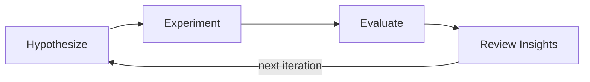

# AURA

AURA (**Au**to **R**esearch **A**nything) is a domain-agnostic framework for building self-improving research loops. An LLM proposes hypotheses, a runner executes them, an evaluator scores the results, and a reviewer distills insights -- then the loop repeats. The code is minimal and hackable, the LLM interface is a single `Callable[[str], str]` that works with any provider, and all run state is persisted as human-readable JSON so runs are resumable and inspectable. It aims at working for hyperparameter search, agent skill creation, code improvement, benchmark generation, and any other scenario that follows a hypothesize-experiment-evaluate cycle. Inspired by [autoresearch](https://github.com/karpathy/autoresearch).



## Installation

```bash
git clone https://github.com/Question406/AutoResearchAnything.git
cd AutoResearchAnything
uv sync
```

## Quick Start

An LLM-guided hyperparameter search in one file:

```python
from aura import (
    Pipeline, Workspace, setup_logging,
    LLMResearcher, ScriptExperimenter, MetricEvaluator, LLMReviewer,
    anthropic_llm,
)

setup_logging()
llm = anthropic_llm(model="claude-sonnet-4-20250514")

workspace = Workspace.create("./runs/experiment")

pipeline = Pipeline(
    researcher=LLMResearcher(
        llm=llm,
        prompt_template="Propose {{ num_tasks }} experiments as JSON list with: id, lr, epochs, batch_size.\n\nContext: {{ inputs }}\nInsights: {{ insights }}",
        num_tasks=3,
    ),
    experimenter=ScriptExperimenter("python train.py --lr {lr} --epochs {epochs} --batch-size {batch_size}"),
    evaluator=MetricEvaluator(metric="accuracy", baseline=0.5),
    reviewer=LLMReviewer(llm=llm),
    workspace=workspace,
    max_iterations=3,
)
pipeline.run()

summary = workspace.summary()
print(f"Best: {summary['best_score']} (task: {summary['best_task_id']})")
```

See [`examples/`](examples/) for runnable demos.

## How It Works

Four pluggable components form the pipeline:

| Component | Role | Built-in implementations |
|---|---|---|
| **Researcher** | Proposes hypotheses to test and modifies seed artifact | `LLMResearcher` |
| **Experimenter** | Executes each experiment | `ScriptExperimenter`, `FunctionExperimenter`, `LLMExperimenter` |
| **Evaluator** | Scores the results | `MetricEvaluator`, `LLMJudgeEvaluator` |
| **Reviewer** | Distills insights from a batch of experiment at this iteration | `LLMReviewer` |

Use the built-in components for common patterns, or implement the [ABCs](docs/architecture.md) for full control. The LLM interface is a simple `Callable[[str], str]` that works with any provider, SDK, or CLI agent.

Every run is fully serialized: hypotheses, experiments, evaluations, and insights are saved as human-readable JSON in a workspace directory. The pipeline supports tracked **artifacts** (files or directories that evolve across iterations) with automatic snapshotting and optional rollback to the best-scoring state.

## Examples

### Mock AutoNAS

An LLM proposes neural architecture hyperparameters, a mock training script evaluates them, and the reviewer's insights guide the next round.

```bash
cd examples/mock-autonas && uv sync
ANTHROPIC_API_KEY=your-key uv run python run.py
```

A CLI-compatible variant is also available in [`examples/mock-autonas-cli/`](examples/mock-autonas-cli/), designed for use with `aura run`.

## Documentation

- [Architecture](docs/architecture.md) -- Design decisions and pipeline internals
- [Examples](examples/) -- Runnable demo applications

## Development

```bash
uv sync && uv run pytest -v
```

## Citation

```bibtex
@software{aura2025,
  title  = {AURA: Auto Research Anything},
  author = {AURA Contributors},
  url    = {https://github.com/Question406/AutoResearchAnything},
  year   = {2025},
}
```

## License

[Apache-2.0](LICENSE)
