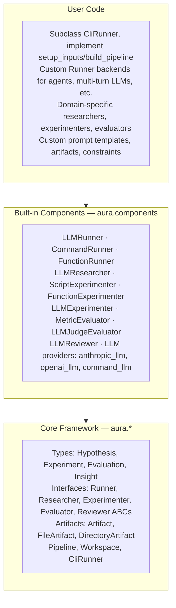
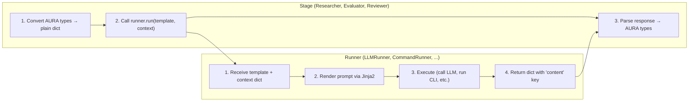
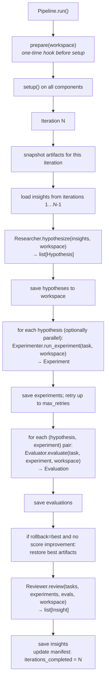
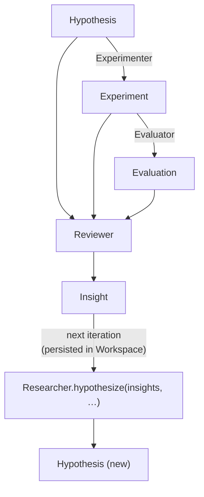
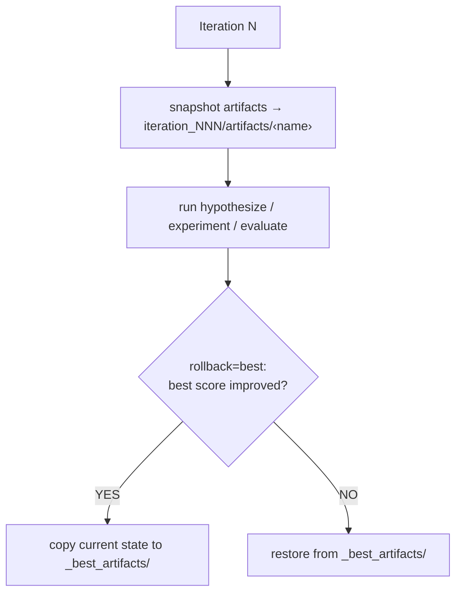

# AURA Architecture

## 1. Three-Layer Architecture



The core framework has zero domain knowledge. It defines contracts (ABCs and Pydantic types) and orchestration logic only. Built-in components implement those contracts for the common case of LLM-driven experiments. User code wires everything together for a specific domain.

---

## 2. Runner Abstraction

Runners are AURA-agnostic execution backends. They decouple *what* a stage needs to do (render a prompt, get a response) from *how* it's done (LLM API, CLI agent, custom function).



**Key principle:** Stages never touch LLMs or CLIs directly. Runners never see AURA types.

### Runner ABC

```python
class Runner(ABC):
    def setup(self, workspace: Workspace) -> None: ...
    def teardown(self) -> None: ...

    @abstractmethod
    def run(self, prompt_template: str, context: dict) -> dict:
        """Returns dict with at least "content" (str).
        Optional: "structured" (dict|list), "steps", "files", "metadata".
        """
```

### Built-in Runners

| Runner | Use case |
|--------|----------|
| `LLMRunner(llm)` | Single LLM API call via `LLMCallable` |
| `CommandRunner(["claude", "-p"])` | CLI agent (claude, codex, aider, etc.) |
| `FunctionRunner(fn)` | Python callable `(prompt, context) -> dict\|str` |

### as_runner()

The `as_runner()` helper normalizes either an `LLMCallable` or a `Runner` into a `Runner`:

```python
as_runner(anthropic_llm())      # → LLMRunner wrapping the callable
as_runner(CommandRunner(...))   # → passes through unchanged
```

Stages call `as_runner()` internally when `runner=` is provided, so users can pass either:

```python
# Both work:
Researcher(runner=anthropic_llm(), prompt_template="...")
Researcher(runner=CommandRunner(["claude", "-p"]), prompt_template="...")
```

### Structured output bypass

When a Runner returns `"structured"` in its result dict, stages use that directly instead of calling `extract_json()` on `"content"`. This lets runners that produce pre-parsed output skip redundant JSON extraction:

```python
class MyRunner(Runner):
    def run(self, prompt_template, context):
        result = my_agent.invoke(prompt_template)
        return {
            "content": result["raw_text"],
            "structured": result["parsed_json"],  # stages use this directly
        }
```

---

## 3. Stage ABCs with Runner Support

The three LLM-backed stage ABCs (Researcher, Evaluator, Reviewer) are **concrete when given a runner**. They handle AURA type conversion and delegate execution to the runner. Without a runner, subclasses must override the core method.

```python
# Option 1: Pass a runner — uses the default implementation
researcher = Researcher(runner=anthropic_llm(), prompt_template="Propose {{ num_tasks }} experiments...")
evaluator = Evaluator(runner=anthropic_llm())
reviewer = Reviewer(runner=anthropic_llm())

# Option 2: Subclass for custom logic — no runner needed
class MyEvaluator(Evaluator):
    def evaluate(self, task, experiment, workspace):
        return Evaluation(task_id=task.id, score=..., passed=...)

# Option 3: Use deprecated convenience classes (same behavior as Option 1)
researcher = LLMResearcher(llm=anthropic_llm(), prompt_template="...")
evaluator = LLMJudgeEvaluator(llm=anthropic_llm())
reviewer = LLMReviewer(llm=anthropic_llm())
```

### Context keys by stage

Each stage builds a plain context dict from AURA types before calling the runner:

| Stage | Context keys |
|-------|-------------|
| Researcher | `insights`, `inputs`, `iteration`, `workspace_root`, `role="researcher"`, plus `**config` |
| Evaluator | `task`, `output`, `trajectory`, `workspace_root`, `role="evaluator"`, plus `**config` |
| Reviewer | `results`, `iteration`, `workspace_root`, `role="reviewer"`, plus `**config` |

---

## 4. Pipeline Flow

Each call to `Pipeline.run()` executes a `prepare` hook (if provided), calls `setup()` on all components, then loops over iterations until `max_iterations` is reached or the loop is interrupted. Within each iteration:



**Resume behavior.** Before executing or evaluating a hypothesis, the pipeline checks whether a file already exists in the workspace. If so, it loads and reuses the saved result. This means a run that crashed mid-iteration can be restarted from the same `run_dir` without duplicating work.

**Insight window.** When `insight_window=K`, the researcher receives insights from the most recent K iterations only, preventing unbounded context growth.

**Prepare hook.** The optional `prepare` callable receives the workspace before any component `setup()` is called. Use it to stage input files, write seed data, or set initial state.

---

## 5. Data Flow



Every object that crosses a component boundary is a Pydantic model. Pydantic enforces types at construction time and provides `model_dump_json` / `model_validate_json` for lossless round-trips through the filesystem.

---

## 6. Artifact System

Artifacts are resources (files or directories) that the pipeline actively modifies and tracks across iterations.



**Snapshotting.** At the start of every iteration, the pipeline calls `artifact.snapshot(dest)` for each registered artifact, saving a copy under `iteration_NNN/artifacts/`. This creates a full history of every artifact state.

**Rollback modes.**

| `rollback=` | Behavior |
|-------------|----------|
| `"none"` (default) | Artifacts accumulate changes across iterations; no rollback occurs |
| `"best"` | After evaluation, if the best score this iteration does not exceed the all-time best, the pipeline restores the last best-scoring artifact state from `_best_artifacts/` |

**Artifact registration.** Pass artifact instances to `Pipeline(artifacts=[...])`. The pipeline registers them on `workspace.artifacts` (a `dict[str, Artifact]` keyed by `artifact.name`) before `setup()` is called, so all components can access them via `workspace.artifacts["name"]`.

**Implementing a custom artifact.**

```python
class Artifact(ABC):
    @property
    @abstractmethod
    def name(self) -> str: ...

    @abstractmethod
    def snapshot(self, dest: Path) -> None: ...

    @abstractmethod
    def restore(self, src: Path) -> None: ...

    @abstractmethod
    def read(self) -> Any: ...

    @abstractmethod
    def write(self, content: Any) -> None: ...

    def diff(self, src: Path) -> str | None:
        return None  # override for diff support
```

---

## 7. Constraints

Constraints are run-level limits or settings shared across all components via the workspace manifest.

```python
Pipeline(
    ...,
    constraints={"time_budget": 60, "max_tokens": 4096},
)
```

When the pipeline starts, it writes the constraints dict into `manifest.json` under the `"constraints"` key. Any component can read them:

```python
limits = workspace.constraints()    # {"time_budget": 60, "max_tokens": 4096}
timeout = limits.get("time_budget", 300)
```

Built-in components that respect constraints:

- `ScriptExperimenter` — uses `constraints["time_budget"]` as the subprocess timeout.
- `FunctionExperimenter` — uses `constraints["time_budget"]` as the thread timeout.
- `LLMExperimenter` — passes the full constraints dict as `{{ constraints }}` in the prompt template.

Components can also call `workspace.set_constraints(d)` at runtime to update the manifest.

---

## 8. Workspace Filesystem Layout

```
<run_dir>/
├── manifest.json                # run metadata: id, status, iterations_completed, constraints, config
├── inputs/                      # seed files read by Researcher; user-populated
│   └── <any files>
├── artifacts/                   # general-purpose artifact storage (workspace.artifacts_dir())
│   └── <any files>
├── _best_artifacts/             # best-scoring artifact snapshot (created by rollback="best")
│   └── <artifact files>
├── iteration_001/
│   ├── tasks/
│   │   ├── <task_id>.json       # Hypothesis (one file per hypothesis)
│   │   └── ...
│   ├── trajectories/
│   │   ├── <task_id>.json       # Experiment
│   │   └── ...
│   ├── evaluations/
│   │   ├── <task_id>.json       # Evaluation
│   │   └── ...
│   ├── artifacts/               # snapshot of all tracked artifacts at start of this iteration
│   │   └── <artifact files>
│   └── insights.json            # list[Insight] for this iteration
├── iteration_002/
│   └── ...
└── ...
```

`Workspace.create(run_dir)` initializes `manifest.json` and `inputs/`. Iteration subdirectories are created lazily on first access. All file names are keyed by `task_id`, so loading a single record by ID is an O(1) path lookup.

The manifest tracks `status` (`"created"` → `"in_progress"` → `"completed"`) and `iterations_completed`, enabling the pipeline to resume after a crash.

---

## 9. LLM Callable Interface

```python
LLMCallable = Callable[[str], str]
```

Every LLM interaction in AURA uses this single-function interface: a string prompt in, a string response out. There is no session object, no streaming, no message history.

**Why a plain function?**

- Components need only call `self.llm(prompt)`. They have no dependency on any SDK.
- Providers (`anthropic_llm`, `openai_llm`, `command_llm`) are factories that capture configuration in a closure and return the callable.
- Any `LLMCallable` is auto-wrapped into `LLMRunner` via `as_runner()` when passed to a stage's `runner=` parameter.
- Testing is trivial: pass `lambda prompt: '["mock task"]'` as the LLM.

```python
# Provider swap — only this line changes
llm = openai_llm("gpt-4o-mini")   # or anthropic_llm(), or command_llm(...)

# New style: pass directly to stage ABCs
researcher = Researcher(runner=llm, prompt_template=PROMPT)
evaluator  = Evaluator(runner=llm)
reviewer   = Reviewer(runner=llm)

# Old style: deprecated convenience classes (still work)
researcher = LLMResearcher(llm, PROMPT)
evaluator  = LLMJudgeEvaluator(llm)
reviewer   = LLMReviewer(llm)
```

---

## 10. Template Syntax

All built-in LLM components use [Jinja2](https://jinja.palletsprojects.com/) for prompt templates. This gives access to the full Jinja2 feature set.

```
{{ variable }}          — interpolate a variable
{{ value | upper }}     — apply a filter
  — loop
      — conditional
```

Example template for `Researcher`:

```
You are designing experiments.

Previous insights:

- {{ insight }}


Inputs:
{{ inputs }}

Propose {{ num_tasks }} experiments as a JSON list.
Each object must have: id, lr, epochs, batch_size.
```

Example template for `LLMResearcher` in artifact mode:

```
Current file ({{ artifact_name }}):
{{ artifact_content }}

Changes since last iteration:
{{ artifact_diff }}

Insights: {{ insights }}

Rewrite the file to improve performance. Output the complete new file.
```

---

## 11. Design Principles

**Zero domain knowledge in the core.** `Pipeline`, `Workspace`, and the ABC interfaces contain no assumptions about what hypotheses look like, what experimentation means, or what a good score is. The `spec` field of `Hypothesis` and the `content` field of `Insight` are open `dict`s. This keeps the core stable while built-in components and user code evolve freely.

**Pydantic for serialization.** All data that crosses component boundaries or is written to disk is a Pydantic `BaseModel`. This gives automatic validation on construction, a canonical JSON representation, and `model_validate_json` for safe deserialization. There is no separate serialization layer.

**Runner/Stage separation.** Runners are AURA-agnostic — they handle prompt rendering and execution. Stages are Runner-agnostic — they handle AURA type marshalling. This lets users swap execution backends (LLM, CLI agent, custom function) without touching stage logic, and write new stages without knowing how prompts are executed.

**ABC + decorator duality.** The four interfaces are abstract base classes, making them the right choice for components with internal state, `setup`/`teardown` logic, or multiple methods. The four `@as_*` decorators wrap a plain function into the equivalent ABC subclass, making them the right choice for stateless, single-function components. Both patterns produce objects that satisfy the same interface — the pipeline cannot tell them apart.

**Idempotent iteration.** Every artifact (hypothesis, experiment, evaluation, insight) is written to a deterministic file path keyed by task ID and iteration number. Before running a step, the pipeline checks whether the file already exists. This makes the pipeline naturally resumable and safe to re-run.

---

## 12. Extending AURA

| Situation | Recommended approach |
|-----------|----------------------|
| Simple stateless logic | `@as_researcher`, `@as_experimenter`, `@as_evaluator`, `@as_reviewer` |
| Need `setup`/`teardown` (e.g., open a DB connection, load a model) | Subclass the ABC directly |
| LLM-driven stage with custom prompts | `Researcher(runner=llm, prompt_template="...")`, `Evaluator(runner=llm)`, `Reviewer(runner=llm)` |
| Code agent backend (claude, codex, etc.) | `Researcher(runner=CommandRunner(["claude", "-p"]), prompt_template="...")` |
| Custom agentic backend (LangGraph, CrewAI, etc.) | Subclass `Runner`, pass to stage via `runner=` |
| Iteratively rewriting a file with LLM | `LLMResearcher` with `artifact="<name>"` and `FileArtifact` |
| Run a script or subprocess | `ScriptExperimenter` with a `command_template` |
| Call an existing Python function | `FunctionExperimenter` |
| Enforce a time limit on experiments | `constraints={"time_budget": N}` on `Pipeline` |
| Numeric metric from output dict | `MetricEvaluator` |
| Qualitative or multi-criteria scoring | `Evaluator(runner=llm)` or `LLMJudgeEvaluator` |
| Track and version a file across iterations | `FileArtifact` |
| Track and version a directory across iterations | `DirectoryArtifact` |
| Roll back to best-scoring state | `Pipeline(rollback="best", artifacts=[...])` |
| New LLM provider or local model | Write a factory function returning `LLMCallable` |
| Custom run orchestration | Subclass `CliRunner`, implement `setup_inputs` and `build_pipeline` |

**Minimal custom runner example:**

```python
class LangGraphRunner(Runner):
    def __init__(self, graph):
        self.graph = graph

    def run(self, prompt_template, context):
        from aura.utils.parsing import render_prompt
        prompt = render_prompt(prompt_template, **context)
        result = self.graph.invoke({"goal": prompt})
        return {"content": result["output"], "structured": result.get("parsed")}

# Use with any stage:
researcher = Researcher(runner=LangGraphRunner(my_graph), prompt_template="...")
```

**Minimal custom experimenter example (ABC):**

```python
class DatabaseExperimenter(Experimenter):
    def setup(self, workspace):
        self.conn = psycopg2.connect(os.environ["DATABASE_URL"])

    def teardown(self):
        self.conn.close()

    def run_experiment(self, task, workspace):
        cur = self.conn.cursor()
        cur.execute(task.spec["query"])
        rows = cur.fetchall()
        return Experiment(
            task_id=task.id,
            status="completed",
            steps=[],
            output={"rows": rows, "count": len(rows)},
        )
```

**Minimal stateless researcher example (decorator):**

```python
@as_researcher
def grid_researcher(insights, workspace):
    return [
        Hypothesis(id=f"lr{lr}-ep{ep}", spec={"lr": lr, "epochs": ep})
        for lr in [1e-3, 1e-4]
        for ep in [10, 20]
    ]
```

**Mix per-stage backends:**

```python
pipeline = Pipeline(
    # Code agent proposes experiments
    researcher=Researcher(
        runner=CommandRunner(["claude", "-p"]),
        prompt_template="Explore the codebase and propose configs based on {{ insights }}",
    ),
    # Script runs experiments
    experimenter=ScriptExperimenter("python train.py --lr {lr}"),
    # Numeric metric for evaluation (no LLM needed)
    evaluator=MetricEvaluator(metric="accuracy", baseline=0.5),
    # LLM reviews results
    reviewer=Reviewer(runner=anthropic_llm()),
    workspace=workspace,
)
```

**Artifact modification pipeline example:**

```python
from aura import FileArtifact, LLMResearcher, Pipeline, Workspace

artifact = FileArtifact(Path("solution.py"))
researcher = LLMResearcher(
    llm=llm,
    prompt_template=REWRITE_PROMPT,
    artifact="solution.py",
)
pipeline = Pipeline(
    researcher=researcher,
    experimenter=FunctionExperimenter(run_tests),
    evaluator=MetricEvaluator("pass_rate", baseline=0.0),
    reviewer=Reviewer(runner=llm),
    workspace=Workspace.create("./runs/code_improvement"),
    artifacts=[artifact],
    rollback="best",
    max_iterations=10,
)
pipeline.run()
```
